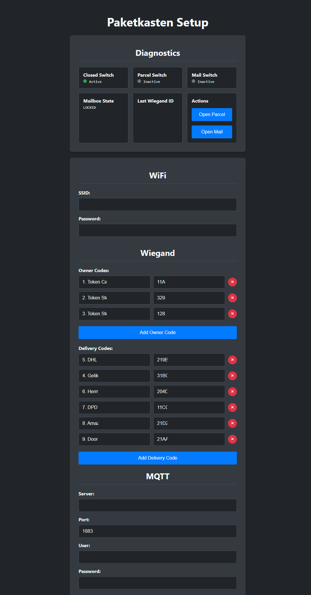
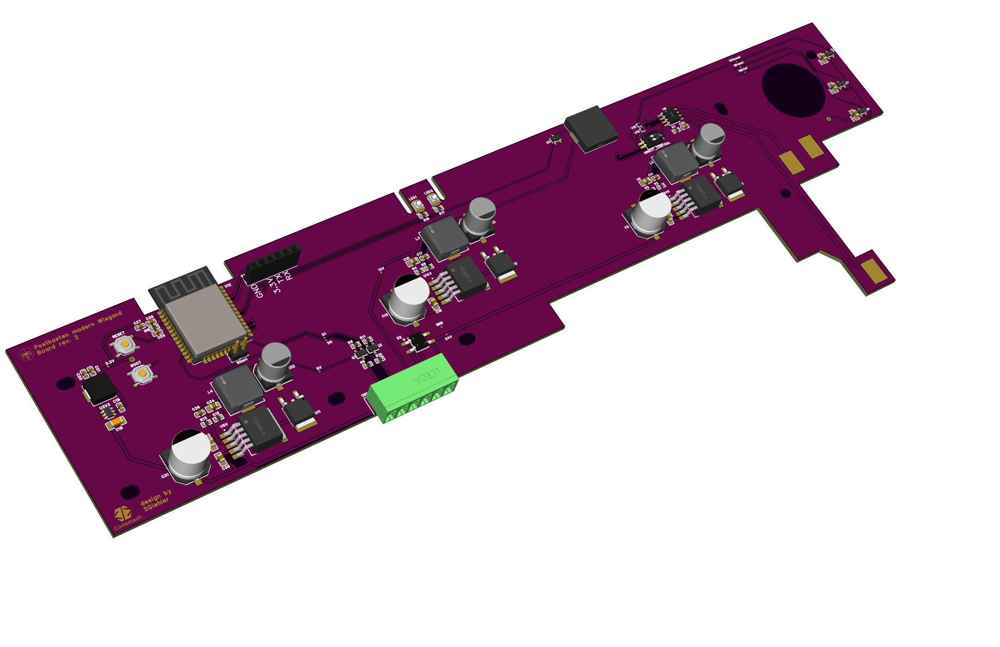
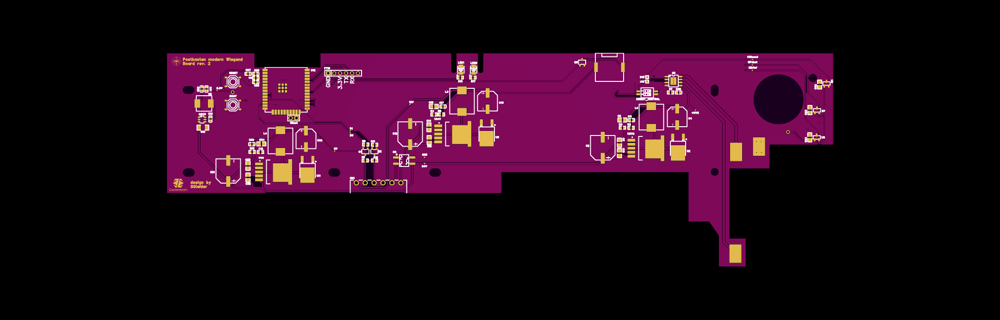
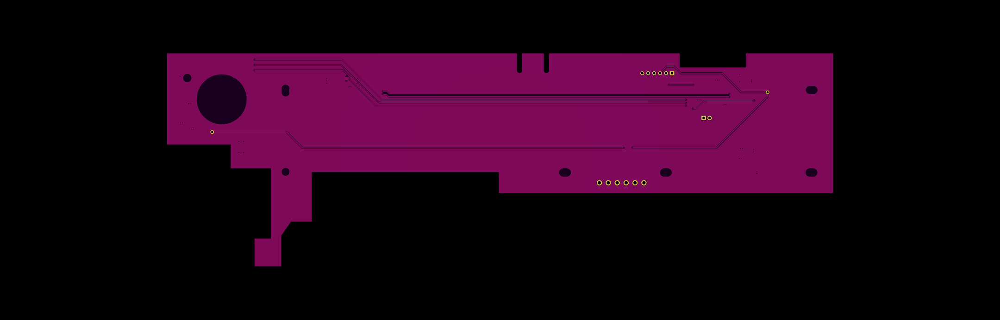

# Paketkasten Revived

Ein Open-Source-Projekt zur Modernisierung und Wiederbelebung des DHL Paketkastens.

## Einleitung

Dieses Projekt wurde ins Leben gerufen, um dem DHL Paketkasten, der von DHL zum End-of-Life erklärt wurde, neues Leben einzuhauchen. Da Zusteller den Paketkasten nicht mehr öffnen können, bietet dieses Projekt eine Lösung, um ihn weiterhin nutzen zu können. Mit einer neuen Hauptplatine und dieser Software wird der Paketkasten für alle Zustelldienste wie Hermes, DPD, Amazon und weitere geöffnet. Dies wird durch die Kompatibilität mit Wiegand-fähigen Tastaturen und RFID-Lesern ermöglicht.

## Features

*   **Webinterface:** Eine moderne und intuitive Weboberfläche zur einfachen Konfiguration des Paketkastens.
*   **MQTT-Integration:** Binden Sie Ihren Paketkasten nahtlos in Ihr Smart-Home-System ein.
*   **WLAN-Konnektivität:** Verbinden Sie den Paketkasten einfach mit Ihrem heimischen WLAN.
*   **Universelle Kompatibilität:** Nutzen Sie eine breite Palette von Wiegand-basierten Zugangsgeräten wie RFID-Leser oder PIN-Tastaturen.
*   **Kompatible Hardware:** Eine Liste der getesteten Wiegand-Geräte finden Sie in der [Wiegand-Hardware-Dokumentation](wiegand-hardware.md).

## Wichtige Hinweise

Für die erweiterten Funktionen ist eine konstante Stromversorgung notwendig. Die Hauptplatine benötigt eine Gleichspannungsversorgung von 14-30V und ist nicht für den Batteriebetrieb ausgelegt.

## Software

Die Weboberfläche bietet eine einfache Möglichkeit, den Paketkasten zu konfigurieren und zu steuern.

**UI Beispiel**

## Hardware

Ein Blick auf die speziell entwickelte Hauptplatine:

**3D-Ansicht**

**Oberseite**

**Unterseite**

## Videos

Öffnen des Brieffachs mit RFID-Leser

Öffnen des Paketfachs mit Code

Prototyp in Aktion

## Mitwirken

Wir freuen uns über Beiträge zur Weiterentwicklung dieses Projekts. Ob Fehlerbehebungen, neue Funktionen oder Verbesserungen der Dokumentation – jede Hilfe ist willkommen.

## Lizenz

Dieses Projekt steht unter der [Creative Commons Attribution-NonCommercial-ShareAlike 4.0 International Lizenz](https://creativecommons.org/licenses/by-nc-sa/4.0/).

## Haftungsausschluss

:warning: **GEFAHR EINES STROMSCHLAGS** :warning:

Wenn Ihr Gerät an das Stromnetz angeschlossen wird, besteht die Gefahr eines Stromschlags, wenn es nicht ordnungsgemäß installiert wird. Wenn Sie nicht wissen, wie man es installiert, rufen Sie bitte einen Elektriker an (***Achtung:*** In bestimmten Ländern ist die Installation ohne einen lizenzierten Elektriker verboten). Denken Sie daran: _**SICHERHEIT GEHT VOR**_. Es ist das Risiko für Sie, Ihre Familie und Ihr Zuhause nicht wert, wenn Sie nicht genau wissen, was Sie tun. 

Wir übernehmen keine Verantwortung, Gewährleistung oder Haftung für die Verwendung dieser Hard- oder Software noch für die Installation oder irgendwelche Tipps, Ratschläge, Videos, etc., die von einem Mitglied dieser Seite oder einer verwandten Seite gegeben werden.
