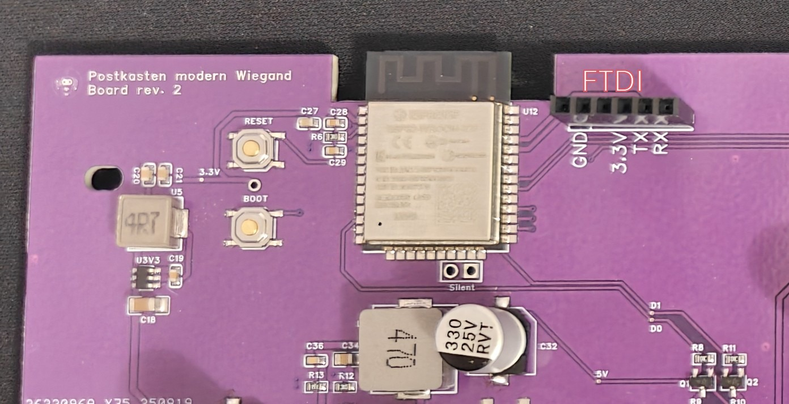

# Flashen mit FTDI-Adapter

> :warning:
> Das Befolgen dieser Anleitung löscht alle Daten auf dem Chip, einschließlich gespeicherter WLAN-Anmeldeinformationen und anderer Einstellungen. Das Gerät wird auf die Werkseinstellungen zurückgesetzt und das Standard-WLAN-Passwort lautet `G67zC4OiB`.

Diese Anleitung erklärt, wie Sie die Firmware und das LittleFS-Dateisystem mit einem FTDI-Adapter und dem Kommandozeilen-Tool `esptool` auf Ihr Gerät flashen.

## Voraussetzungen

1.  **esptool:** Stellen Sie sicher, dass Sie [esptool v5.1.0 oder neuer](https://github.com/espressif/esptool/releases/tag/v5.1.0) installiert haben und es von Ihrer Kommandozeile aus zugänglich ist.
2.  **FTDI-Adapter:** Ein funktionierender FTDI-Adapter, der mit den Programmier-Pins Ihres Geräts verbunden ist.
3.  **Binärdateien:** Laden Sie die neuesten Release-Assets von der [GitHub-Releases-Seite](https://github.com/SGiehler/paketkasten-modern-mainboard/releases) herunter. Sie benötigen `complete-firmware.bin`.

## Flash-Vorgang

1.  **Download-Modus starten:**
    *   Halten Sie die **Boot**-Taste auf der Platine gedrückt.
    *   Während Sie die **Boot**-Taste gedrückt halten, drücken Sie kurz die **Reset**-Taste.
    *   Lassen Sie die **Boot**-Taste los. Das Gerät befindet sich nun im Bootloader-Modus und ist bereit zum Flashen.

    

2.  **Binärdateien flashen:**
    Öffnen Sie Ihr Terminal oder Ihre Eingabeaufforderung und navigieren Sie zu dem Verzeichnis, in das Sie die Release-Dateien heruntergeladen haben. Führen Sie den folgenden Befehl aus und ersetzen Sie `<PORT>` durch den seriellen Port Ihres FTDI-Adapters (z. B. `COM3` unter Windows oder `/dev/ttyUSB0` unter Linux):

    **Kommandozeile:**
    ```bash
    esptool --chip esp32 --port <PORT> --baud 921600 --before default_reset --after hard_reset write_flash -z --flash_mode dio --flash_freq 80m --flash_size 4MB 0x0 complete-firmware-v1.2.0.bin
    ```

    Dieser Befehl flasht alle erforderlichen Komponenten an die richtigen Stellen im Flash-Speicher des ESP32.

Nachdem der Befehl erfolgreich abgeschlossen wurde, setzt `esptool` das Gerät automatisch zurück und es startet mit der neuen Firmware.