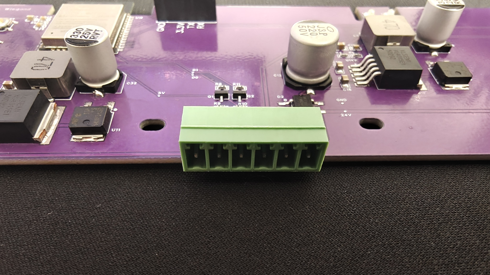
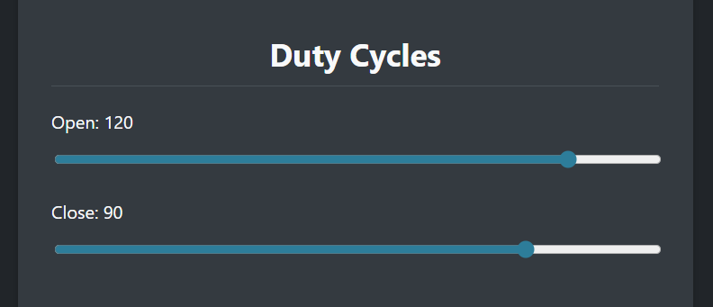
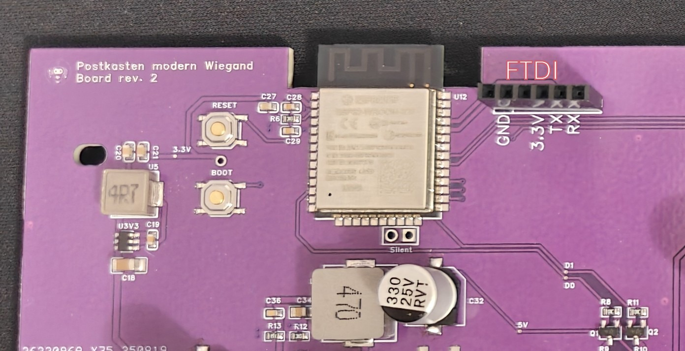
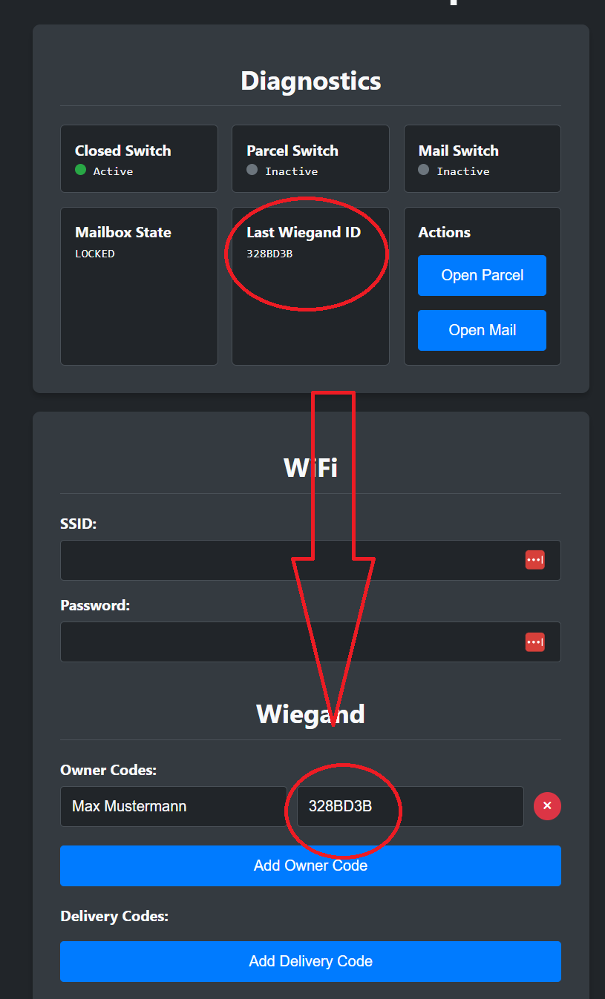

# Projektbeschreibung

Dieses Projekt ist ein Paketkasten-System, das die sichere und effiziente Zustellung von Paketen ermöglicht. Es integriert ein Wiegand-Keypad für den Zugang und ist für den Betrieb mit einer Gleichstromversorgung von 14-36V ausgelegt.

## Inhaltsverzeichnis

- [Mainboard tauschen](#mainboard-tauschen)
- [Pin-Beschreibung](#pin-beschreibung)
- [LED-Statusanzeigen](#led-statusanzeigen)
- [Duty Cycle](#duty-cycle)
- [MQTT-Integration](#mqtt-integration)
  - [MQTT-Status (Topic: `paketkasten/state`)](#mqtt-status-topic-paketkastenstate)
  - [MQTT-Befehle (Topic: `paketkasten/command`)](#mqtt-befehle-topic-paketkastencommand)
- [Flashen des ESP32 Mikrocontrollers](#flashen-des-esp32-mikrocontrollers)
- [Zugangskontrolle](#zugangskontrolle)

# Mainboard tauschen

In diesem Video wird gezeigt, wie das alte Mainboard gegen das neue getauscht wird.

# Pin-Beschreibung

Die Pins sind von links nach rechts wie folgt belegt:

1.  **+12V für Keypad**: Stromversorgung für das Wiegand-Keypad.
2.  **D0 Wiegand**: Datenleitung 0 des Wiegand-Protokolls.
3.  **D1 Wiegand**: Datenleitung 1 des Wiegand-Protokolls.
4.  **GND**: Masseanschluss für das Wiegand-Keypad.
5.  **Stromzufuhr 14-36V DC**
6.  **Stromzufuhr 14-36V DC**

Die Pins 5 und 6 für die Stromzufuhr sind verpolungssicher ausgelegt.

# LED-Statusanzeigen

Die Status-LEDs (Grün und Rot) zeigen den aktuellen Zustand des Systems an:

| Zustand                                           | Grüne LED | Rote LED |
| :------------------------------------------------ | :-------- | :------- |
| **Verriegelt (LOCKED)**                           | ⚫       | ⚫      |
| **Paketfach oder Briefkasten geöffnet (PARCEL_OPEN / MAIL_OPEN)** | 🟢        | ⚫      |
| **Öffnet oder Verriegelt (OPENING_TO_PARCEL / OPENING_TO_MAIL / LOCKING)** | ⚫       | 🔴       |
| **Motorfehler (MOTOR_ERROR)**                     | 🟢        | 🔴       |

# Duty Cycle

Der Duty Cycle beschreibt das Verhältnis der Einschaltdauer eines Motors zur gesamten Betriebszeit und beeinflusst direkt die Geschwindigkeit des Motors. Ist der Duty Cycle zu hoch, kann der Paketkasten blockieren. Ist er zu niedrig, reicht das initiale Drehmoment möglicherweise nicht aus, um den Kasten zu bewegen. Es ist wichtig, den Duty Cycle korrekt einzustellen, um einen reibungslosen Betrieb zu gewährleisten. 

Geht der Kasten nicht auf oder zu, sollte dieser Wert in 5er schritten erhöht werden. Sollte der Kasten blockieren muss man leider die Elektronik wieder ausbauen und den Motor einmal herausnehmen, da er selbstständig aus der Blockade nicht wieder heraus kommt. In diesem Fall sollte der Duty Cycle reduziert werden.

# MQTT-Integration

Das System nutzt MQTT zur Kommunikation von Statusinformationen und zum Empfang von Befehlen.

## MQTT-Status (Topic: `paketkasten/state`)

Der aktuelle Status des Paketkastens wird als JSON-Objekt auf dem Topic `paketkasten/state` veröffentlicht. Das Objekt enthält die Felder `state` und `last_used`.

Mögliche Werte für `state`:

*   `LOCKED`: Der Paketkasten ist verriegelt.
*   `OPENING_TO_PARCEL`: Der Paketkasten öffnet sich für ein Paket.
*   `PARCEL_OPEN`: Das Paketfach ist geöffnet.
*   `OPENING_TO_MAIL`: Der Paketkasten öffnet sich für Briefe/Post.
*   `MAIL_OPEN`: Das Brief-/Postfach ist geöffnet.
*   `LOCKING`: Der Paketkasten verriegelt sich.
*   `MOTOR_ERROR`: Es ist ein Fehler mit dem Motor aufgetreten.
*   `UNKNOWN`: Unbekannter Zustand.

Das Feld `last_used` gibt an, wodurch die letzte Zustandsänderung ausgelöst wurde (z.B. `webinterface`, `mqtt`, `unknown`).

## MQTT-Befehle (Topic: `paketkasten/command`)

Das System kann Befehle über das Topic `paketkasten/command` empfangen. Aktuell unterstützte Befehle (als String im Payload):

*   `OPEN_PARCEL`: Öffnet das Paketfach, falls der Paketkasten verriegelt ist.
*   `OPEN_MAIL`: Öffnet das Brief-/Postfach, falls der Paketkasten verriegelt ist.

# Flashen des ESP32 Mikrocontrollers

Um den ESP32 Mikrocontroller zu flashen, gehen Sie wie folgt vor:

1.  **FTDI Adapter anschließen**: Stecken Sie einen FTDI Adapter in den Header, der mit "FTDI" beschriftet ist.
2.  **Spannungseinstellung**: Stellen Sie sicher, dass der FTDI Adapter auf **3.3V** eingestellt ist. Dies ist WICHTIG, um Schäden am ESP33 zu vermeiden.
3.  **Download-Modus aktivieren**:
    *   Halten Sie die **BOOT**-Taste auf dem Mainboard gedrückt.
    *   Drücken Sie kurz die **RESET**-Taste, während Sie die BOOT-Taste weiterhin gedrückt halten.
    *   Lassen Sie die **BOOT**-Taste los.
    Der ESP32 befindet sich nun im Download-Modus und ist bereit für das Flashen.

# Zugangskontrolle

Es gibt zwei Arten von Codes: Owner Codes und Delivery Codes.

*   **Owner Codes**: Öffnen sowohl das Brief- als auch das Paketfach.
*   **Delivery Codes**: Öffnen nur das Paketfach.

**Hinweis**: Wenn der Paketkasten Modern kein Brieffach besitzt (da dies optional ist), gibt es keinen Unterschied zwischen Owner Codes und Delivery Codes. In diesem Fall öffnen beide Code-Typen nur das Paketfach.

Um einen Code hinzuzufügen, geben Sie einen RFID-Chip oder Code am Wiegand-Keypad ein. Die "Last Wiegand ID" wird dann unter "Diagnostics" angezeigt. Diese ID muss anschließend in die Owner Codes oder Delivery Codes übernommen werden.